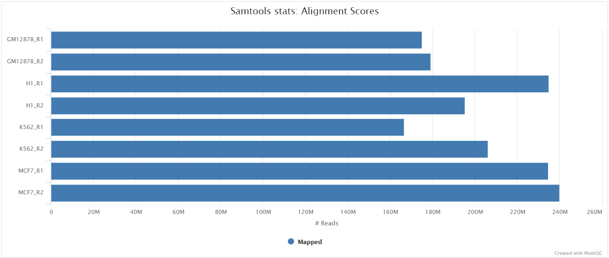
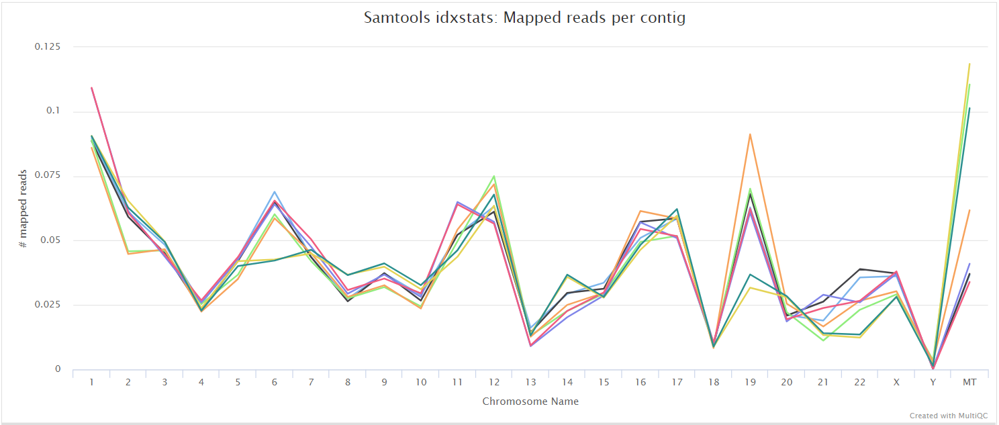

# SpikyClip/llrnaseq: Output

## Introduction

This document describes the output produced by the pipeline. Most of the plots
are taken from the MultiQC report, which summarises results at the end of the
pipeline.

The directories listed below will be created in the results directory after the
pipeline has finished. All paths are relative to the top-level results
directory.

<!-- TODO nf-core: Write this documentation describing your workflow's output -->

## Pipeline overview

The pipeline is built using [Nextflow](https://www.nextflow.io/) and processes
data using the following steps:
* [Preprocessing](#preprocessing)
  * [cat](#cat) - Merge re-sequenced FastQ files
  * [FastQC](#fastqc) - Raw read QC
  * [TrimGalore](#trimgalore) - Adapter and quality trimming

* [Alignment](#alignment)
  * [HISAT2](#hisat2) - Memory efficient splice aware alignment to a reference

* [Alignment post-processing](#alignment-post-processing)
  * [SAMtools](#samtools) - Sort and index alignments

* [Quantification](#quantification)
  * [StringTie](#stringtie) - Transcript assembly and quantification

* [Quality control](#quality-control)
  * [MultiQC](#multiqc) - Aggregate report describing results and QC from the
    whole pipeline

* [Workflow reporting and genomes](#workflow-reporting-and-genomes)
  * [Reference genome files](#reference-genome-files) - Saving reference genome indices/files
  * [Pipeline information](#pipeline-information) - Report metrics generated
    during the workflow execution

## Preprocessing

### cat

Output files

* `fastq/`
    * `*.merged.fastq.gz`: If `--save_merged_fastq` is specified, concatenated
      FastQ files will be placed in this directory.

If multiple libraries/runs have been provided for the same sample in the input
samplesheet (e.g. to increase sequencing depth) then these will be merged at
the very beginning of the pipeline in order to have consistent sample naming
throughout the pipeline. Please refer to the [usage
documentation](https://nf-co.re/rnaseq/usage#samplesheet-input) to see how to
specify these samples in the input samplesheet.

### FastQC

Output files

* `fastqc/`
    * `*_fastqc.html`: FastQC report containing quality metrics.
    * `*_fastqc.zip`: Zip archive containing the FastQC report, tab-delimited
      data file and plot images.

[FastQC](http://www.bioinformatics.babraham.ac.uk/projects/fastqc/) gives
general quality metrics about your sequenced reads. It provides information
about the quality score distribution across your reads, per base sequence
content (%A/T/G/C), adapter contamination and overrepresented sequences. For
further reading and documentation see the [FastQC help
pages](http://www.bioinformatics.babraham.ac.uk/projects/fastqc/Help/).

> **NB:** The FastQC plots displayed in the MultiQC report shows _untrimmed_
> reads. They may contain adapter sequence and potentially regions with low
> quality.

### TrimGalore

Output files

* `trimgalore/`
    * `*.fq.gz`: If `--save_trimmed` is specified, FastQ files **after**
      adapter trimming will be placed in this directory.
    * `*_trimming_report.txt`: Log file generated by Trim Galore!.
* `trimgalore/fastqc/`
    * `*_fastqc.html`: FastQC report containing quality metrics for read 1
      (*and read2 if paired-end*) **after** adapter trimming.
    * `*_fastqc.zip`: Zip archive containing the FastQC report, tab-delimited
      data file and plot images.

[Trim Galore!](https://www.bioinformatics.babraham.ac.uk/projects/trim_galore/)
is a wrapper tool around Cutadapt and FastQC to peform quality and adapter
trimming on FastQ files. By default, Trim Galore! will automatically detect and
trim the appropriate adapter sequence.

> **NB:** TrimGalore! will only run using multiple cores if you are able to use
> more than > 5 and > 6 CPUs for single- and paired-end data, respectively. The
> total cores available to TrimGalore! will also be capped at 4 (7 and 8 CPUs
> in total for single- and paired-end data, respectively) because there is no
> longer a run-time benefit. See [release
> notes](https://github.com/FelixKrueger/TrimGalore/blob/master/Changelog.md#version-060-release-on-1-mar-2019)
> and [discussion whilst adding this logic to the nf-core/atacseq
> pipeline](https://github.com/nf-core/atacseq/pull/65).

## Alignment

### HISAT2

Output files

* `hisat2/`
    * `<SAMPLE>.bam`: If `--save_align_intermeds` is specified the original BAM
      file containing read alignments to the reference genome will be placed in
      this directory.
* `hisat2/log/`
    * `*.log`: HISAT2 alignment report containing the mapping results summary.
* `hisat2/unmapped/`
    * `*.fastq.gz`: If `--save_unaligned` is specified, FastQ files containing
      unmapped reads will be placed in this directory.

[HISAT2](http://daehwankimlab.github.io/hisat2/) is a fast and sensitive
alignment program for mapping next-generation sequencing reads (both DNA and
RNA) to a population of human genomes as well as to a single reference genome.
It introduced a new indexing scheme called a Hierarchical Graph FM index (HGFM)
which when combined with several alignment strategies, enable rapid and
accurate alignment of sequencing reads. The HISAT2 route through the pipeline
is a good option if you have memory limitations on your compute. However,
quantification isn't performed if using `--aligner hisat2` due to the lack of
an appropriate option to calculate accurate expression estimates from HISAT2
derived genomic alignments. However, you can use this route if you have a
preference for the alignment, QC and other types of downstream analysis
compatible with the output of HISAT2.

HISAT2 is the only aligner provided in the llrnaseq pipeline.

## Alignment post-processing

### SAMtools

Output files

* `<ALIGNER>/`
    * `<SAMPLE>.sorted.bam`: If `--save_align_intermeds` is specified the
      original coordinate sorted BAM file containing read alignments will be
      placed in this directory.
    * `<SAMPLE>.sorted.bam.bai`: If `--save_align_intermeds` is specified the
      BAI index file for the original coordinate sorted BAM file will be placed
      in this directory.
    * `<SAMPLE>.sorted.bam.csi`: If `--save_align_intermeds --bam_csi_index` is
      specified the CSI index file for the original coordinate sorted BAM file
      will be placed in this directory.
* `<ALIGNER>/samtools_stats/`
    * SAMtools `<SAMPLE>.sorted.bam.flagstat`, `<SAMPLE>.sorted.bam.idxstats`
      and `<SAMPLE>.sorted.bam.stats` files generated from the alignment files.

The original BAM files generated by the selected alignment algorithm are
further processed with [SAMtools](http://samtools.sourceforge.net/) to sort
them by coordinate, for indexing, as well as to generate read mapping
statistics.

## Quantification

### featureCounts

Output files

* `<ALIGNER>/featurecounts/`
    * `*.featureCounts.txt`: featureCounts biotype-level quantification results
      for each sample.
    * `*.featureCounts.txt.summary`: featureCounts summary file containing
      overall statistics about the counts.
    * `*_mqc.tsv`: MultiQC custom content files used to plot biotypes in
      report.

[featureCounts](http://bioinf.wehi.edu.au/featureCounts/) from the
[Subread](http://subread.sourceforge.net/) package is a quantification tool
used to summarise the mapped read distribution over genomic features such as
genes, exons, promotors, gene bodies, genomic bins and chromosomal locations.
The counts for each gene can then be used for gene differential analysis.

### StringTie

Output files

* `<ALIGNER>/stringtie/`
    * `*.coverage.gtf`: GTF file containing transcripts that are fully covered
      by reads.
    * `*.transcripts.gtf`: GTF file containing all of the assembled transcipts
      from StringTie.
    * `*.gene_abundance.txt`: Text file containing gene aboundances and FPKM
      values.
* `<ALIGNER>/stringtie/<SAMPLE>.ballgown/`: Ballgown output directory.

[StringTie](https://ccb.jhu.edu/software/stringtie/) is a fast and highly
efficient assembler of RNA-Seq alignments into potential transcripts. It uses a
novel network flow algorithm as well as an optional de novo assembly step to
assemble and quantitate full-length transcripts representing multiple splice
variants for each gene locus. In order to identify differentially expressed
genes between experiments, StringTie's output can be processed by specialized
software like [Ballgown](https://github.com/alyssafrazee/ballgown),
[Cuffdiff](http://cole-trapnell-lab.github.io/cufflinks/cuffdiff/index.html) or
other programs
([DESeq2](https://bioconductor.org/packages/release/bioc/html/DESeq2.html),
[edgeR](https://bioconductor.org/packages/release/bioc/html/edgeR.html), etc.).

### MultiQC

Output files

* `multiqc/`
    * `multiqc_report.html`: a standalone HTML file that can be viewed in your
      web browser.
    * `multiqc_data/`: directory containing parsed statistics from the
      different tools used in the pipeline.
    * `multiqc_plots/`: directory containing static images from the report in
      various formats.

[MultiQC](http://multiqc.info) is a visualization tool that generates a single
HTML report summarising all samples in your project. Most of the pipeline QC
results are visualised in the report and further statistics are available in
the report data directory.

Results generated by MultiQC collate pipeline QC from supported tools e.g.
FastQC. The pipeline has special steps which also allow the software versions
to be reported in the MultiQC output for future traceability. For more
information about how to use MultiQC reports, see <http://multiqc.info>.

## Workflow reporting and genomes

### Reference genome files

Output files

* `genome/`
    * `*.fa`, `*.gtf`, `*.gff`, `*.bed`, `.tsv`: If the `--save_reference`
      parameter is provided then all of the genome reference files will be
      placed in this directory.
* `genome/index/`
    * `hisat2/`: Directory containing HISAT2 indices.

A number of genome-specific files are generated by the pipeline because they
are required for the downstream processing of the results. If the
`--save_reference` parameter is provided then these will be saved in the
`genome/` directory. It is recommended to use the `--save_reference` parameter
if you are using the pipeline to build new indices so that you can save them
somewhere locally. The index building step can be quite a time-consuming
process and it permits their reuse for future runs of the pipeline to save disk
space.

### Pipeline information

Output files

* `pipeline_info/`
    * Reports generated by Nextflow: `execution_report.html`,
      `execution_timeline.html`, `execution_trace.txt` and
      `pipeline_dag.dot`/`pipeline_dag.svg`.
    * Reports generated by the pipeline: `pipeline_report.html`,
      `pipeline_report.txt` and `software_versions.tsv`.
    * Reformatted samplesheet files used as input to the pipeline:
      `samplesheet.valid.csv`.

[Nextflow](https://www.nextflow.io/docs/latest/tracing.html) provides excellent
functionality for generating various reports relevant to the running and
execution of the pipeline. This will allow you to troubleshoot errors with the
running of the pipeline, and also provide you with other information such as
launch commands, run times and resource usage.
